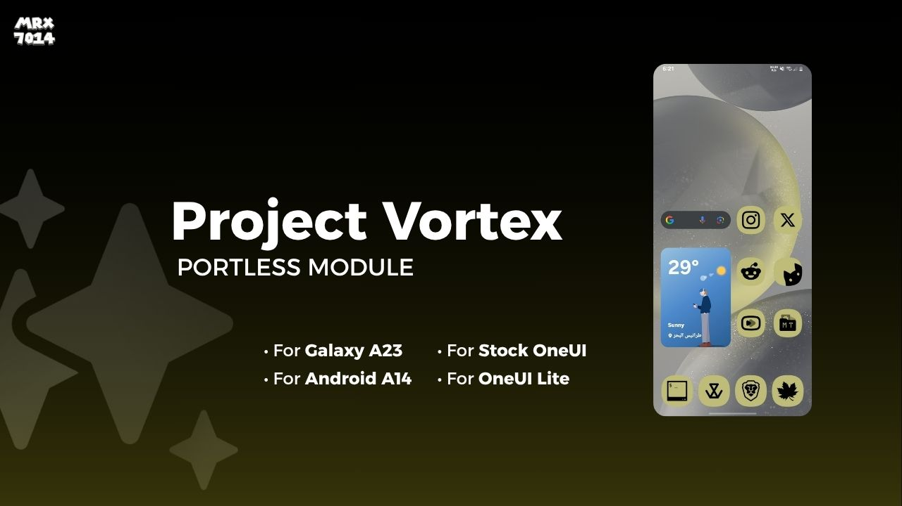

# Project Vortex

  
   

  
**Unlock Flagship Experience For Your Galaxy A23 4G**
  

---

## Note
> [!CAUTION] 
> 1. For Galaxy A23 4G Only
> 2. For Android 14 With Stock or OneUI Lite
> 3. Don't install any spoofer (S24 or S25) with it
> 4. Check apps updates after install module from Galaxy Store
> 5. Check apps updates always from Galaxy Store
> 6. Don't update Photo Editor App EVER
> 7. Install **[SuperMario-Tweaker](https://github.com/mrx7014/SuperMario-Tweaker)** to improve performance

## 🚀 Features

- High End Chinese Animations
- S series OneUI Launcher
- Circle to Search
- Performance Profile
- Processing Speed
- Dolby Atmos without Headsets
- Flagship Edge Ligthining+
- Multi Users
- Mic Focus Mode
- Battery Information (From S25 Series)
- Photo Remaster
- Almost All AI features (Call Assist, Chat Assist, Note Assist, Transcript assist, Browsing Assist, Photo Assist, Drawing Assist)
- Debloater for junk apps
- S24 Live Wallpapers
- Spoof device as S24+
- Spoof OneUI Version to 6.1.1
- Support Offical Good Lock from Galaxy Store
- Change device photo in About Info to S24+
- New About Info UI
- OneUI 7 UI Sounds
- Samsung Galaxy S24 Boot Animation

---

## ⚙️ Installation Guide  
> [!TIP]
> 1. Ensure **Magisk**, **KSU**, or **KSU NEXT** is installed on your device.  
> 2. Download Project Vortex from Releases
> 3. Open **Root Manager** > Go to "Modules" > Tap "+" > Select the downloaded file.  
> 4. Wait for the installation to complete, then reboot your device.  

---
## 🧑‍💻 Credits

**Developed & maintained by:** MRX7014

For updates and support, join our Telegram channel: **[MRX7014Cloud](https://t.me/MRX7014Cloud)**, **[A23 4G Channel](https://t.me/A235channel)**
